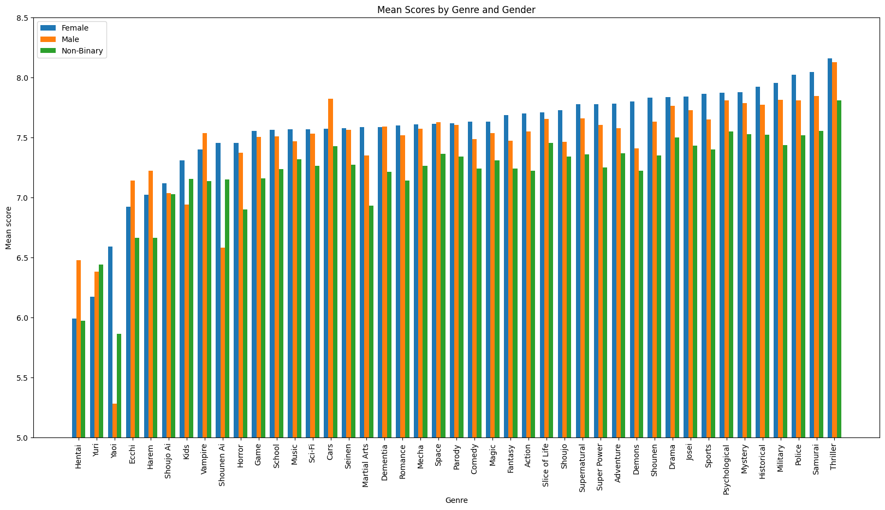

# **Insight into anime data**
Project for the course: Introduction to Data Science (Sissejuhatus andmeteadusesse) - LTAT.02.002

#### Group C6 - Kert Karsna, Jako Aimsalu, Kristofer Klassen

---

### **Motivation:**
In recent years, the number of anime released annually has risen to 200 animated films/series per year.
Some releases are very successful, but not all are well-received by viewers.
To understand some of the reasons that make an anime "highly rated" or, conversely, less appreciated, we analyzed the anime dataset and made our conclusions.
Also since all the members are watching anime, the processing can give ourselves additional input and insight into new anime and anime to add into our "_watch later_" pile :) .

---

### **Objectives:**
By processing the data, our aim was to find out some interesting questions about genres and trends in anime, for example which anime is popular and if a highly-rated anime also tends to be popular.
Additionally, the project will explore whether there are genres or genre combinations that appeal more to audiences in terms of both ratings and popularity.
The goal of this data mining project was to understand user preferences and identify patterns in anime reviews by analyzing the dataset with over 35 million review entries.
Key objectives included addressing scoring imbalances, such as the tendency for users to favor the lowest scoring disproportionately and exploring the relationships between anime genres, types and other attributes.

---

### **Description/explanation:**

Analyzation of the anime dataset from Kaggle.com [dataset](https://www.kaggle.com/datasets/dbdmobile/myanimelist-dataset).
Download final_animedataset.csv and place it into the root directory of your project.

The repository consist of Jupyter notebooks that do dataprocessing and generate visualizations/graphs about some more interesting (to us, subjectively) data.

We made user specific analysis conducted on 100k entries, where users have given ratings for different anime.
And by combining those anime genres by score, you can have look into user's preferences form a genre perspective.
This can be found in jako-main.ipynb "Look into User specific analyse".
We have also tried to capture and explain notable trends and correlations in the data using methods and strategies/approaches learned in this course.

*Top 10 Genres by Frequency plot shows the number of time a single genre has appeared in the dataset. Keep in mind that duplicates are also present.*

*Mean score by genres and gender show, how different genders (and also others non-binary) have in general rated each genres. This might indicate how well accepted some genres for the other are related. The plot is sorted following female rating scores.*

*With weighted user ratings and total ratings graph we can see overall anime types and how are they rated by average. Anime ratings are weighted by the amount of users, that have scored it world wide. And the graph also shows frequency of anime types in the dataset.*

*In this 3-dimentional graph a rating to popularity correlation will be visualised. Popularity ranking is a placement. Another visualisation is based on rating loss (the ratio of the rating that have been left unrated). This would result in distribution and overall average of the ratings.*

We also have made user specific analysis conducted on 100k entries, where users have given ratings for different animes. And by combining those anime genres by score, you can have look into user's preferences form a genre perspective. This can be found in selge.ipynb "Look into User specific analyse". We have also tried to capture notable trends and correlations in the data using methods and 

---

### **Problems/issues encountered:**

Computational power and data storage were significant limiting factors and one of the biggest problems we had to overcome by optimizing the computations.

---

### **Project structure:**

All .ipynb files in the root directory of this repository were used to analyze, (pre-)process and visualize the data.
user_analyze.csv file is used in the jako-main.ipynb file for user specific analyzations.
Most of the more relevant graphs and visualizations are in the folder "visualizations".
There is also a 2nd HW "C6_report.pdf" and our project poster "C6-poster.pdf" in the root of this repository.

---